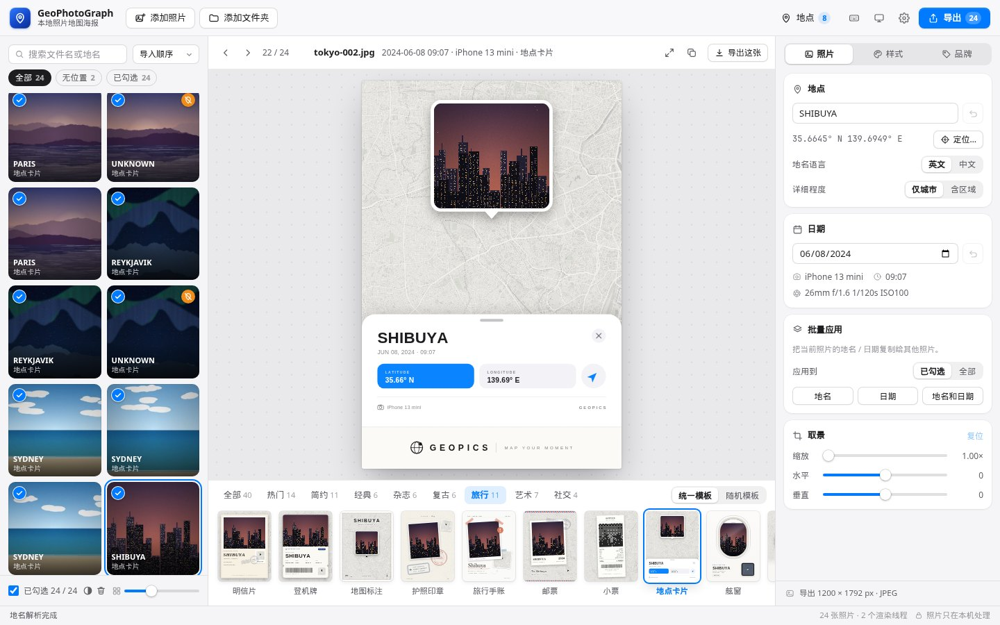
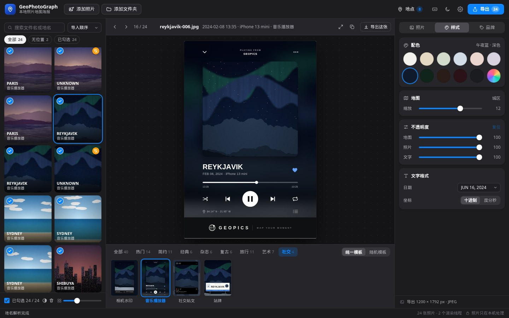
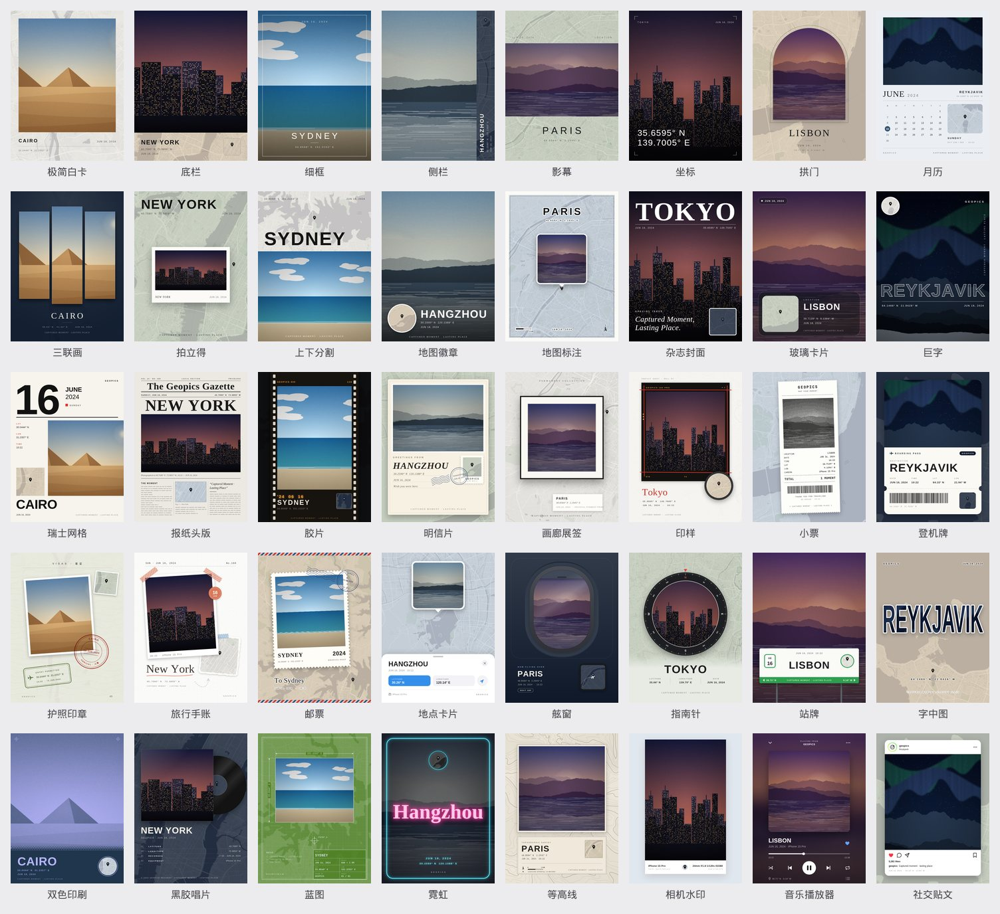

# GeoPhotoGraph Local

在 Mac 本地运行的照片「地理 + 日期」海报工具。读取照片 EXIF 中的 GPS、拍摄时间与相机参数，反查地名、拼接地图，生成带地点 / 日期的海报图片，成百上千张照片也能并行批量处理。

功能参考微信小程序 [earthonliner/GeoPhotoGraph](https://github.com/earthonliner/GeoPhotoGraph)，去除了会员、付费与强制水印，仅供本地个人使用。



## 快速开始

需要 Node.js >= 18.17（macOS 推荐 20+）。

```bash
npm install     # 仅开发/e2e 测试需要 puppeteer-core，运行本身零依赖
npm start       # 启动本地服务并打开浏览器 http://127.0.0.1:5178
```

也可 `npx geophotograph --port 8080 --no-open`。推荐使用 Chrome / Edge（可直接导出到磁盘文件夹）；Safari 亦可使用（导出为 ZIP）。

## 界面

- 三栏布局：左侧照片库，中间是实时预览与模板栏，右侧检查器分「照片 / 样式 / 品牌」三页。外观可跟随系统，也可固定为浅色或深色。
- 照片库：按文件名或地名搜索；按导入顺序、拍摄时间、文件名、地名排序；「全部 / 无位置 / 已勾选」筛选；缩略图大小可调；⌘ 单击多选、⇧ 单击连续选择、反选。移除照片可撤销，不会删除原文件。
- 预览：所见即所得。拖动照片调整取景，滚轮或双指缩放，双击复位；大图预览按导出分辨率渲染；可以复制海报图片，或只导出当前这张。
- 模板栏：按分类浏览，缩略图直接用当前照片实时渲染。「统一模板」一次应用到全部照片；「随机模板」从当前分类里给每张照片随机分配，该分类的模板轮完一遍才会重复，可重新洗牌，也可只应用到已勾选的照片。
- 地点汇总：按地名归类全部照片，直接改名即对该地名下的所有照片生效；没有位置的照片可以一次批量定位。
- 编辑记忆：记住每张照片的地名、日期、定位、模板与取景，再次导入同一批照片时自动恢复（可在设置中关闭或清除）。
- 还没导入照片时，用内置示例照片预览全部模板。



### 键盘快捷键

| 按键 | 作用 |
| --- | --- |
| ← → | 上一张 / 下一张 |
| ↑ ↓ | 在网格中上下移动 |
| [ ] | 上一个 / 下一个模板 |
| ← →（焦点在模板栏） | 点选一个模板后，左右箭头逐个切换模板并实时预览 |
| Space | 勾选 / 取消勾选当前照片 |
| ⌘A / ⇧⌘A | 勾选全部 / 取消全部勾选 |
| ⌫ | 移除当前照片（可撤销） |
| Enter | 大图预览 |
| ⌘C | 复制当前海报 |
| L | 设置位置 |
| ⌘O / ⌘E | 添加照片 / 导出 |
| ? | 快捷键帮助 |

## 模板

40 个模板，分 7 类，另有「热门」精选：

| 分类 | 模板 |
| --- | --- |
| 简约 | 极简白卡、底栏、细框、侧栏、影幕、坐标、拱门、月历、三联画 |
| 经典 | 拍立得、上下分割、地图徽章、地图标注 |
| 杂志 | 杂志封面、玻璃卡片、巨字、瑞士网格、报纸头版 |
| 复古 | 胶片、明信片、画廊展签、印样、小票 |
| 旅行 | 登机牌、护照印章、旅行手账、邮票、地点卡片、舷窗、指南针、站牌 |
| 艺术 | 字中图、双色印刷、黑胶唱片、蓝图、霓虹、等高线 |
| 社交 | 相机水印、音乐播放器、社交贴文 |



- 配色：11 种预设（纸白、沙丘、鼠尾草、雾蓝、裸粉、灰紫、午夜蓝、墨绿、咖啡、酒红、石墨）加自定义颜色，地图随主题着色。
- 可调地图缩放，地图 / 照片 / 文字不透明度，日期格式（JUN 16, 2024 / 16 JUNE 2024 / 2024.06.16 / 2024-06-16 / 2024年6月16日）与坐标格式（十进制 / 度分秒）。
- 品牌：海报下方的品牌栏（品牌名、副标题、二维码 / Logo）与海报标语都可以自定义或关闭。
- 「相机水印」模板完整显示照片不裁切，并印上 EXIF 里的机型与曝光参数（焦距、光圈、快门、ISO）；这些参数也显示在检查器中。

## 功能

- 导入：拖入照片或文件夹（JPEG / HEIC / PNG / WebP / TIFF 等），自动读取 EXIF 的 GPS、拍摄时间、方向、机型与曝光参数。
- 地点与日期可逐张或批量编辑；地名语言（英文，中文地名自动转拼音 / 中文）、地名层级（仅城市 / 含区域）。
- 手动定位：搜索地名或输入坐标（可选 GCJ-02 转换），可批量应用。
- 大批量：Web Worker 池并行渲染、缩略图懒加载、EXIF 只读文件头部、地名按网格合并请求并缓存；导出带进度、ETA、取消、失败重试。
- 导出：范围（已勾选 / 全部 / 仅当前）；JPEG（可调质量）或 PNG；清晰度 2x / 3x / 4x；命名模式（`{name}_geo`，变量 `{name} {place} {date} {template} {index}`，自动去重不覆盖）；
  输出到本地文件夹（默认 `~/Pictures/GeoPhotoGraph`）、浏览器直接写入所选目录，或 ZIP（约 400 MB / 500 张自动分卷）。
- HEIC：浏览器无法解码时，由本地服务调用 macOS 自带 `sips` 转换（仅 macOS）。

## 地图与地名服务

在「设置」中选择：

| 地图 | 说明 |
| --- | --- |
| Esri（默认） | 无需密钥的灰色底图，缩放上限 16，请遵守 Esri 使用条款 |
| OpenStreetMap | 无需密钥，客户端转灰度；请遵守 OSM 瓦片使用政策，不要短时间内大批量抓取 |
| Mapbox | 需 token，支持亮/暗样式，质量最好 |
| 自定义 | 自填 `{z}/{x}/{y}`（可含 `{s}`）瓦片地址 |

瓦片经本地服务代理并缓存到 `~/.geophotograph/cache/`，重复导出不会重复请求。

地名反查默认使用 Nominatim（限速 1 次/秒，同一网格合并请求并缓存）。已知限制：对中国大陆、日本等地区，Nominatim 返回的「城市」常为区县级；如需更准确的城市名，请在设置中填 Mapbox token，或在预览中手动编辑地点（「地点汇总」可一次改完同名的所有照片）。

配置保存在 `~/.geophotograph/config.json`（权限 0600，Mapbox token 不会返回给前端）。可用环境变量 `GEOPHOTOGRAPH_HOME` 修改目录。

## 安全

服务只监听 `127.0.0.1`，校验 Host / Origin（防 DNS rebinding 与跨站请求），静态资源路径与保存文件名均做校验，不会覆盖已有文件，「在 Finder 中显示」仅限输出目录。照片始终在本机处理，仅地图瓦片与地名查询会访问外部服务。

## 开发与测试

```bash
npm test               # 单元 / 服务端测试（node:test），包含全部模板在多种数据与主题下的绘制检查
npm run test:e2e       # 无头 Chrome 端到端测试，截图输出到 tests/e2e/out/（需要 Chrome，可用 CHROME_PATH 指定）
python3 scripts/make-sample-photos.py 300   # 生成带 GPS / 日期 / 相机参数的示例照片到 sample-photos/
```

目录结构：

- `server/`：配置、瓦片代理、地名反查、保存 / 转换。
- `public/js/lib/`：EXIF、地理、绘制、ZIP 等共享模块，主线程与 Worker 共用。模板在 `posters.js`、`posters-more.js`、`posters-extra.js`，公共绘制工具在 `poster-kit.js`。
- `public/js/ui/`：照片库、模板栏、检查器、对话框、大图预览等界面模块。
- `public/js/workers/`：渲染 Worker。

## 致谢

模板设计与功能来自原项目 GeoPhotoGraph（该仓库未声明许可证，本项目仅作个人本地使用）。地图数据 © Esri / OpenStreetMap contributors / Mapbox。
